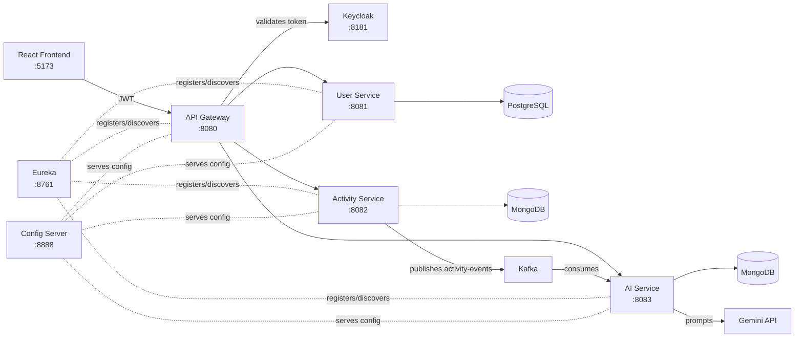

# 🏃‍♂️ Fitness Tracker — Microservices Edition

> *Six small services walk into a gateway. One tracks your sweat, one
> remembers your name, one talks to an AI about your life choices.*

A Spring Boot microservices backend for logging workouts and turning them
into AI-generated coaching advice — built service-by-service, the way
real distributed systems are: independently deployable, occasionally
chatty over Kafka, and held together by a service registry that knows
where everyone lives.

---

## 🧠 What it actually does

1. You log in through **Keycloak** (real OAuth2/PKCE, not a fake login form).
2. You register and track a workout — *"Running, 30 minutes, 300 calories."*
3. That activity gets dropped onto a **Kafka** topic the instant it's saved.
4. The **AI service** picks it up, asks **Gemini** what it thinks, and
   stores a recommendation.
5. You ask for that recommendation later and get something more useful
   than *"good job!"*

No single service knows about all of this end-to-end — that's the point.

---

## 🗺️ Architecture



| Service | Port | Job | Talks to |
|---|---|---|---|
| **eureka** | 8761 | Service registry — the office directory everyone checks before calling anyone | — |
| **configserver** | 8888 | Hands out config to every other service so nothing is hardcoded | — |
| **gateway** | 8080 | Front door. Validates JWTs, routes to the right service | Keycloak, Eureka |
| **userservice** | 8081 | Registration & profiles | PostgreSQL |
| **activityservice** | 8082 | Logs workouts, fires Kafka events | MongoDB, Kafka |
| **aiservice** | 8083 | Listens for activity events, asks Gemini for advice | MongoDB, Kafka, Gemini |
| **fitness-frontend** | 5173 | React + Vite UI | Gateway, Keycloak |

---

## 🛠️ Tech stack

`Java 24` · `Spring Boot 3.5` · `Spring Cloud` (Eureka · Config · Gateway) ·
`PostgreSQL` · `MongoDB` · `Apache Kafka` · `Keycloak (OAuth2/PKCE)` ·
`React + Vite` · `Maven`

---

## 🚀 Running it

**The fast way (Docker):**

```bash
docker compose up --build
```
Spins up Postgres, MongoDB, Kafka, Keycloak, all 5 backend services, and
the frontend together. Visit **http://localhost:5173**.

**The manual way (each service its own terminal):**

```bash
# 1. Infra first
docker run -d -p 5432:5432 -e POSTGRES_PASSWORD=admin@123 -e POSTGRES_DB=fitness-micro-user postgres:16
docker run -d -p 27017:27017 mongo:7
# + Kafka and Keycloak

# 2. Spring Boot services, in this order
cd eureka          && ./mvnw spring-boot:run   # wait for it to come up
cd configserver     && ./mvnw spring-boot:run
cd userservice      && ./mvnw spring-boot:run
cd activityservice  && ./mvnw spring-boot:run
cd aiservice        && ./mvnw spring-boot:run
cd gateway          && ./mvnw spring-boot:run

# 3. Frontend
cd fitness-frontend && npm install && npm run dev
```

You'll need a free Gemini API key from [aistudio.google.com/apikey](https://aistudio.google.com/apikey)
for `aiservice` to generate real recommendations — everything else
works without one.

---

## 📡 API reference

| Method | Endpoint | What it does |
|---|---|---|
| `POST` | `/api/users/register` | Create a user |
| `GET`  | `/api/users/{userId}` | Fetch a profile |
| `GET`  | `/api/users/{userId}/validate` | Check a user exists |
| `POST` | `/api/activities` | Log an activity (needs `X-User-ID` header) |
| `GET`  | `/api/activities` | List a user's activities |
| `GET`  | `/api/recommendations/user/{userId}` | All recommendations for a user |
| `GET`  | `/api/recommendations/activity/{activityId}` | Recommendation for one activity |

All routes go through the gateway at `localhost:8080` and expect a
Keycloak-issued JWT — except when you hit the services directly on
their own ports, where there's no auth at all (handy for quick
Postman testing, not for production).

---

## 📁 Project layout

```
fitness-tracker-microservices/
├── eureka/             # service registry
├── configserver/       # centralized config, served from /config/*.yml
├── gateway/             # routing + JWT auth
├── userservice/        # profiles, PostgreSQL
├── activityservice/    # workout tracking, MongoDB + Kafka producer
├── aiservice/           # Kafka consumer + Gemini integration
└── fitness-frontend/    # React + Vite UI
```

---

## 🧭 Roadmap

- [ ] `GET /api/activities/summary?period=weekly|monthly` — totals and
      a breakdown by activity type
- [ ] Streak tracking and goal-setting
- [ ] Push notifications when a new recommendation lands

---

## 🤝 Contributing

Built while working through a Spring Boot microservices course, then
extended further. PRs and issues welcome if you want to poke at it —
it's a good sandbox for distributed-systems patterns (service
discovery, centralized config, event-driven communication, gateway
auth) without the scale of a "real" production system getting in the way.
